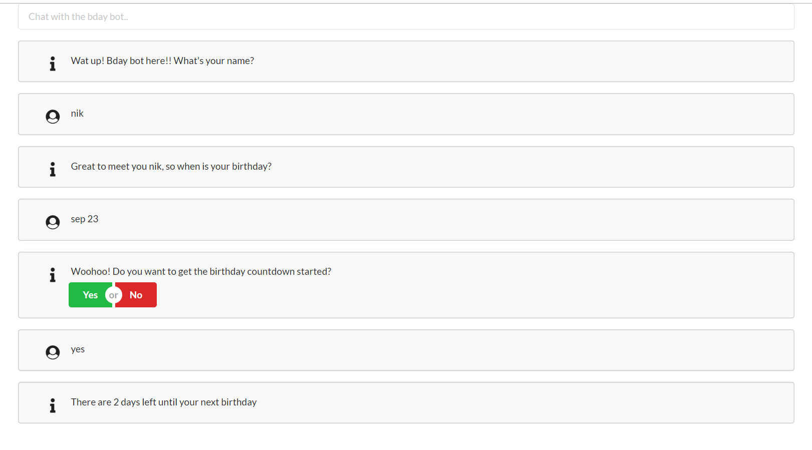

# Bday Bot
A simple but cool chatbot that starts a conversation with a user. The bot asks:
- your name
- when is your birthday
- if you would like to know how many days until your birthday, bday bot expects a yes/no answer to this question
- if you say yes bday bot tells you how many days until your bday or else he says goodbye

  

# Architecture 
## Database 
To mimic a database I am using [JSON-SERVER](https://github.com/typicode/json-server#database)
JSON Server supports RESTful API conventions by default which means we don't even need to create custom routes to perform actions on the data. Data is stored inside the "messages" array in db/db.json. The nice thing is whenever a message is saved it is automatically assigned an id which we can use to access or delete a certain message. 

Setup: 
- cd db
- npm install
- npm start

URL:
http://localhost:3000

Default Routes: 
- GET    /messages
- GET    /messages/{id}
- POST   /messages
- PUT    /messages/{id}
- PATCH  /messages/{id}
- DELETE /messages/{id} 

## Express/Socket.io Server
Socket.io is used to handle sending/receiving mesages between bday bot and users.  

Setup: 
- cd server
- npm install
- npm start

URL:
http://localhost:3001

Test:
- npm run test 

## React App
The front end is a basic app that interfaces between the bot and the user. For styling I am using Semantic UI. 

Setup: 
- cd client
- npm install
- npm start
- go to url http://localhost:3002

# Ideas for new features
- generate birthday card showing how many days until bday
- connect to horoscope API to show info about your sign
- share random fun facts on events that happened on your bday
- connect to event APIs to display events happening on your bday
- further customize to be like a birthday planner, that would require more advanced AI features
- integrate with existing services like FB or whatsapp 